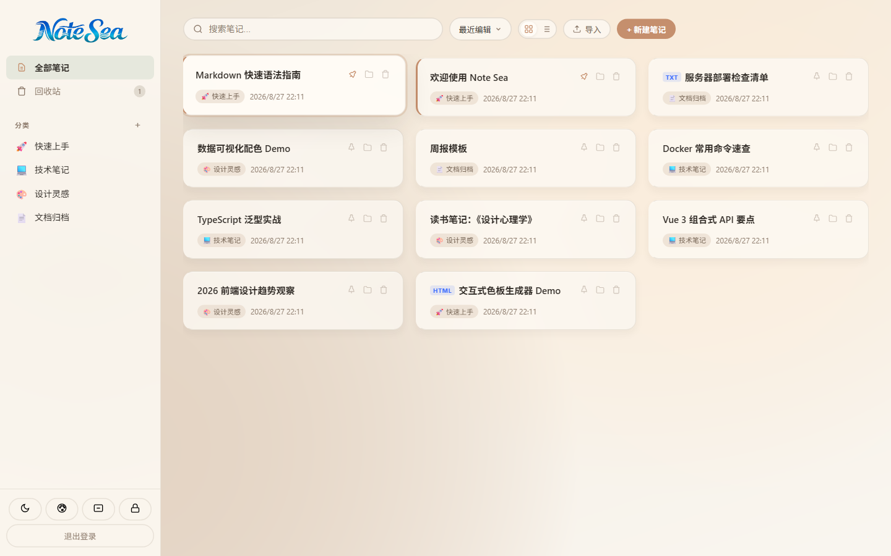
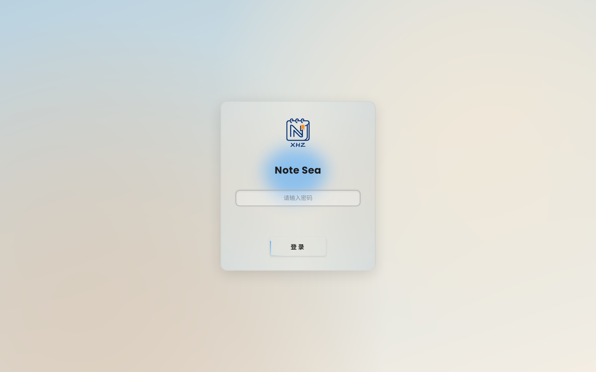
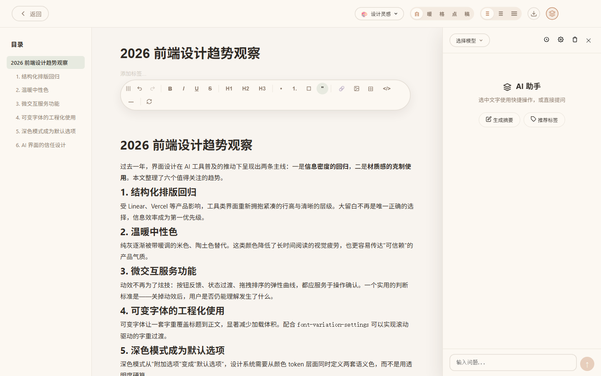
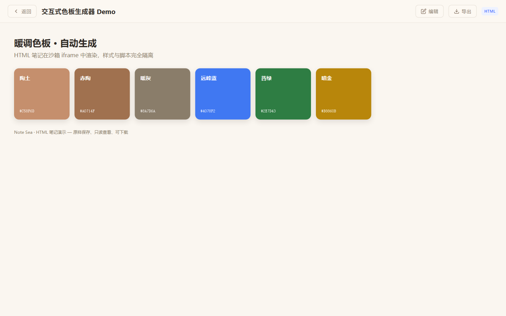
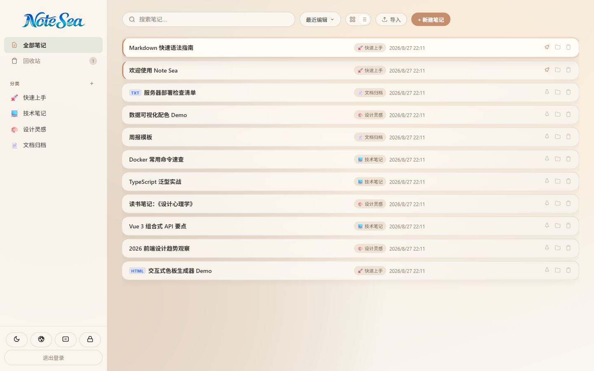

# Note Sea 🌊

自托管的轻量级个人知识库。富文本笔记、多格式文件导入、AI 助手、一键备份——所有数据留在你自己的服务器上。



## 界面一览

| | |
|---|---|
|  |  |
|  |  |

## 功能特性

**笔记管理**
- 五种笔记类型：富文本、HTML（沙箱渲染）、PDF、图片、纯文本
- 一键导入 `.md` / `.html` / `.docx` / `.pdf` / 图片 / `.txt`，自动按类型建档
- 分类、标签、置顶、全文搜索、回收站（可恢复 / 彻底删除）
- TipTap 富文本编辑器：图片上传可缩放、表格、代码块、快捷键

**AI 助手**
- 支持 OpenAI 兼容接口与 Anthropic 接口，可配置多个提供商
- 内置润色 / 翻译 / 总结 / 解释 / 扩写快捷操作
- 自定义系统指令，每次对话自动注入

**数据自主**
- SQLite 本地存储，无需外部数据库
- zip 一键备份导出（不含密码与 API Key）
- 合并式导入恢复：按 id 跳过已存在条目，不覆盖不删除现有数据

**界面**
- 亮 / 暗主题，登录页与主页背景图自定义，界面透明度调节
- 卡片 / 列表双视图，响应式布局

**安全**
- 访问密码 bcrypt 加密，登录限流防爆破
- JWT 鉴权（7 天有效期，Secret 自动生成）
- 上传文件类型白名单（jpg/png/gif/webp/pdf/docx，50MB 上限）
- HTML 笔记在 `sandbox` iframe 中渲染，与主应用隔离
- CORS 白名单、AI 接口 SSRF 防护、备份导入防路径穿越

## 技术栈

前端 **Vue 3** + Pinia + Vue Router + TipTap + Vite；后端 **Node.js** + Express + better-sqlite3；进程管理 PM2。

## 快速开始

要求：Node.js ≥ 18，npm ≥ 9。

```bash
git clone https://github.com/xhuaizhi/note-sea.git
cd note-sea
npm run setup   # 安装前后端依赖并构建前端
npm start       # 启动服务
```

浏览器打开 `http://localhost:3000`，首次访问会提示设置访问密码（至少 8 位）。

## 配置

复制 `.env.example` 为 `.env` 按需修改：

| 变量 | 默认值 | 说明 |
|------|--------|------|
| `PORT` | `3000` | 服务监听端口 |
| `ALLOWED_ORIGINS` | 不限制 | 允许的跨域来源，逗号分隔；生产环境建议设置 |

生产环境部署（PM2 / Nginx 反向代理 / HTTPS / 定时备份）见 [DEPLOY.md](DEPLOY.md)。

## 数据与备份

所有数据（笔记数据库、上传文件、配置）都在 `server/data/` 目录：

- **应用内备份**：设置 → 数据备份 → 导出 zip；导入时合并恢复，已存在条目自动跳过
- **命令行备份**：`tar -czf backup-$(date +%Y%m%d).tar.gz server/data/`

## 项目结构

```
note-sea/
├── client/          # Vue 3 前端源码 (构建产物 dist/ 由 npm run setup 生成)
├── server/          # Express 后端
│   ├── routes/      # auth / notes / ai 路由
│   └── data/        # SQLite 数据库与上传文件 (自动生成, 含敏感数据, 勿提交)
├── docs/screenshots # 界面截图
├── .env.example     # 环境变量模板
└── ecosystem.config.cjs
```

## License

[MIT](LICENSE)

## 友情链接

- [LINUX DO - 新的理想型社区](https://linux.do/)

